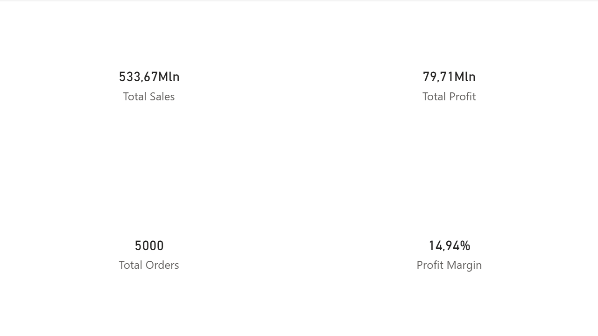
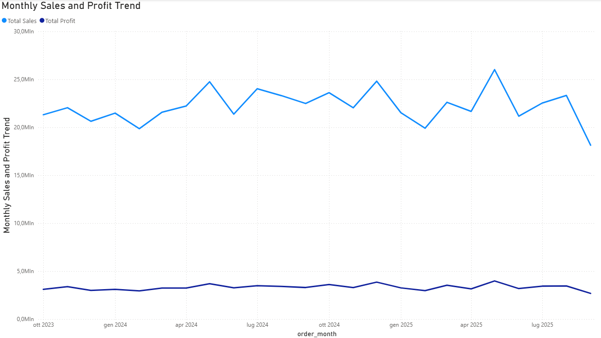
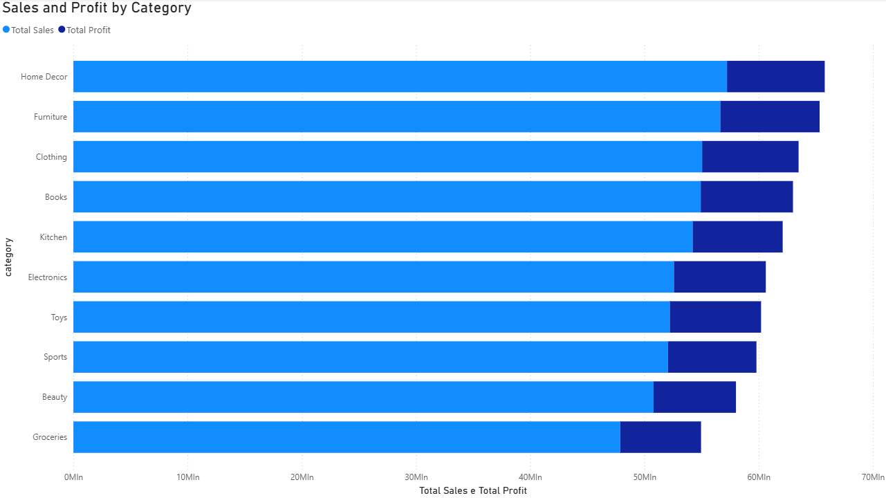
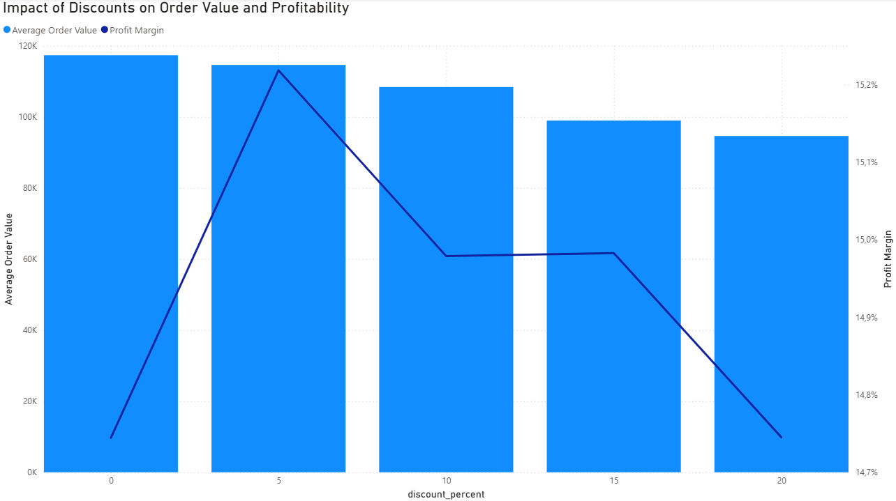
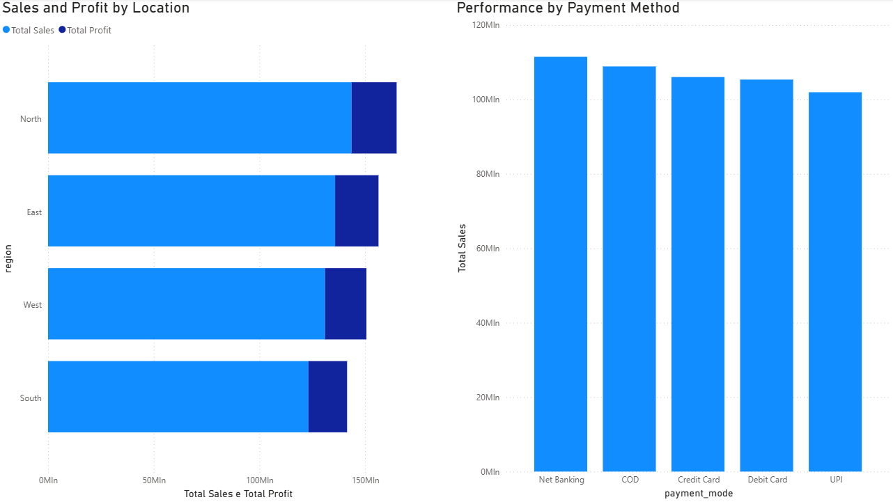

# E-commerce Sales Analysis  
### SQL-Driven Business Analysis & Power BI Dashboard

---

## Project Overview

This project simulates a real-world **e-commerce sales analysis workflow**, with a strong focus on **business reasoning**, **data modeling**, and **decision-oriented insights**.

The objective is not to showcase complex tooling, but to demonstrate how a **Data Analyst** would operate in a professional environment:

- ingest raw business data  
- prepare and model it using SQL  
- extract meaningful, actionable insights  
- communicate results through a clean, executive-level dashboard  

All data transformations and business logic are implemented in **PostgreSQL**, while **Power BI** is used exclusively for metrics calculation and visualization.

---

## Dataset Description

- **Source:** Kaggle  
- **Type:** E-commerce sales data  
- **Nature:** Synthetic but realistic  
- **Time period:** 2023–2025  
- **Rows:** 5,000  
- **Columns:** 14  
- **Format:** Single CSV file  

### Main Fields
- Order identifiers and dates  
- Customer and geographic information (region, city)  
- Product hierarchy (category, sub-category, product)  
- Quantities, unit prices, discounts  
- Sales and profit  
- Payment mode  

The synthetic nature of the dataset is explicitly acknowledged and documented.  
While the data does not represent a real company, its distributions and relationships are realistic enough to support meaningful business analysis.

---

## Initial Data Understanding (Python EDA)

Before loading the data into PostgreSQL, a **lightweight exploratory analysis** was performed in Python to validate structure and data quality.

This step is documented in the notebook:

- `notebooks/01_quick_eda.ipynb`

### Key Findings
- No missing values across all columns (0% nulls)  
- `Order Date` fully parseable as datetime (0% parsing errors)  
- Numeric fields show consistent and reasonable ranges  
- Profit values are always positive, confirming the synthetic design  

### Important Observations
- `Order Date` is stored as string and requires proper casting  
- `Discount` ranges from 0 to 20 and is interpreted as a percentage  
- `Unit Price` values are high but internally consistent  
- No feature engineering is performed at this stage  

Python is used **only for data understanding and validation**, not for transformations.

---

## Data Modeling & Preparation (PostgreSQL)

All data preparation is implemented in PostgreSQL following an **ELT-style approach**.

### Raw Layer
- The CSV file is loaded into a dedicated `raw` schema  
- All columns are stored as TEXT  
- No constraints, transformations, or data types are applied  
- The raw layer exists solely for ingestion and traceability  

This guarantees that the original data remains untouched and fully reproducible.

---

### Staging Layer

A staging layer (`staging.stg_orders`) is created to make the data analysis-ready.

Key transformations include:
- Explicit type casting  
  - Dates converted to DATE  
  - Quantities and prices converted to numeric types  
- Standardized column naming (snake_case)  
- Creation of derived business fields:  
  - `gross_revenue` = quantity × unit_price  
  - `cost_estimate` = sales − profit  
  - `order_month` = month-level time dimension  

All transformations are implemented as **SQL logic**, ensuring transparency and reproducibility.

All SQL queries used for data preparation, data quality checks, and business analysis are stored in the `sql/` directory and organized by logical step.

---

## Data Quality Checks

Before performing any business analysis, multiple SQL-based checks were executed:

- Row count consistency between raw and staging layers  
- Validation of date ranges and temporal coverage  
- Detection of invalid numeric values (negative quantities, prices, sales, or profit)  
- Discount range validation  
- Logical duplicate checks on order identifiers  
- Consistency check between gross revenue and net sales  

### Results
- No invalid or impossible values detected  
- All records passed numeric and range validations  
- Sales differ from gross revenue, confirming correct discount application  
- The dataset spans nearly two years, enabling meaningful trend analysis  

At this point, the dataset is considered **analysis-ready**.

---

## Business Analysis (SQL)

All business analysis is performed directly in PostgreSQL using the **staging layer as the single source of truth**.

The focus is on answering realistic business questions rather than producing isolated metrics.

---

### KPI Overview

Overall business performance:
- **Total Orders:** 5,000  
- **Total Sales:** 533.7M  
- **Total Profit:** 79.7M  
- **Average Order Value:** ~106.7K  
- **Profit Margin:** ~14.9%  

The margin level is realistic for an e-commerce context and remains stable across the dataset.

---

### Sales & Profit Trends

- Monthly data spans from October 2023 to October 2025  
- Sales typically range between 20M and 25M per month  
- Profit closely follows sales, consistent with a stable margin  
- Seasonal patterns are visible, with stronger performance in May and December  
- October 2025 is identified as a partial month and treated accordingly  

This temporal coverage supports trend and seasonality analysis.

---

### Category & Sub-Category Performance

**Category level:**
- Sales and profit are evenly distributed  
- No single category dominates the business  
- Margins are relatively uniform  

**Sub-category level:**
- Clear differences in profitability emerge  
- Sub-categories within the same category behave differently  
- Example: within Books, Non-Fiction outperforms Fiction in margin  

This highlights the importance of granular analysis for pricing and promotion decisions.

---

### Discount Analysis

Discounts were analyzed as a potential growth and efficiency lever.

Key insights:
- Higher discounts do not increase total sales  
- Average order value decreases as discounts increase  
- Profit margins peak at moderate discount levels (1–5%)  
- Aggressive discounts (>15%) reduce order value without improving profitability  

Discounts act primarily as an **efficiency lever**, not a volume driver.

---

### Geographic Performance

- The North region leads in sales and profit  
- The East region shows the highest profit margin  
- Regional margins are relatively homogeneous  

At city level:
- Sales are distributed across multiple cities  
- No concentration risk emerges  
- Margins remain consistent  

Geography impacts volume more than profitability.

---

### Payment Mode Analysis

- Net Banking and Cash on Delivery generate the highest sales volumes  
- Digital payment methods show slightly higher margins  
- Differences across payment modes are present but not extreme  

Payment behavior influences volume more than overall business efficiency.

---

## Data Visualization & Dashboarding (Power BI)

The final stage translates SQL-based insights into a **decision-oriented Power BI dashboard**.

The dashboard follows a **minimalist, business-first design**, prioritizing clarity over visual complexity.

### Dashboard Structure
1. **Executive Overview**  
   - Core KPIs: Sales, Profit, Orders, Profit Margin  

2. **Monthly Trends**  
   - Sales and Profit over time  
   - Seasonality and long-term patterns  

3. **Category & Sub-Category Analysis**  
   - Category comparison with drill-down  
   - Identification of granular profitability drivers  

4. **Discount Analysis**  
   - Average Order Value vs Profit Margin  
   - Clear evidence against aggressive discounting  

5. **Geography & Payment**  
   - Regional performance comparison  
   - Payment method analysis  

### Design Principles
- One main insight per page  
- Minimal number of visuals  
- No redundant KPIs or unnecessary slicers  
- Consistent metrics across SQL and Power BI  
- Business logic in SQL, visualization in Power BI  

---

## Power BI Dashboard File

The Power BI (.pbix) file is intentionally not stored in this repository due to its binary nature and limited version control support.

Below is a preview of the Power BI dashboard used to visualize and communicate the analysis results.

### Dashboard Preview

**Executive Overview**  

**Monthly Trends**  

**Category & Sub-Category Analysis**  

**Discount Analysis**  

**Geography & Payment**  

---

## Key Takeaways

- The project mirrors a realistic Data Analyst workflow  
- SQL is used as the analytical backbone  
- Power BI is used for communication, not transformation  
- The focus is on **decision support**, not tool complexity  

This project is designed to be representative of **entry-level professional work**, rather than an academic exercise.

